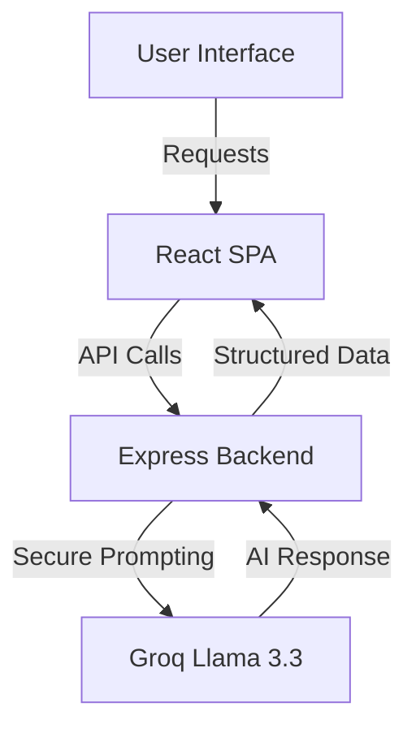

<div align="center">

# 📧 ClickMail AI: The Marketing Tutor
### *Crafting high-converting emails, powered by Intelligence*

<p align="center">
  
</p>

[](https://reactjs.org/)
[](https://nodejs.org/)
[-f55036?style=for-the-badge&logo=openai&logoColor=white)](https://groq.com/)
[](LICENSE)

[**🌐 Live Platform**](https://tutormarketing.vercel.app/) • [**🤖 Interactive AI Demo**](https://refactorclickmail.onrender.com/demo)

---

### 🚀 ¿Qué es ClickMail AI?
**ClickMail** no es solo una herramienta de email marketing; es un **Mentor de Negocios**. 
Utilizamos IA de vanguardia para que dejes de "adivinar" y empieces a "vender". 

*Describe tu producto → Recibe estrategia + Código HTML listo para usar.*

</div>

---

## 🧠 El Concepto "Profesor Mode"
A diferencia de otros generadores, nuestra IA funciona en **Modo Tutor**. 
Cuando le pides una campaña, el sistema:
1.  **Analiza** tu solicitud.
2.  **Explica** la psicología de marketing detrás de la propuesta.
3.  **Genera** el código HTML optimizado para dispositivos móviles.

---

## 🏗️ Arquitectura de Producción
Diseñado con una arquitectura de **microservicios desacoplados** para garantizar velocidad y seguridad total.

*   **Frontend (Vercel):** Una experiencia SPA ultra-fluida construida con **React 18** y **TypeScript**.
*   **Backend (Render):** El "cerebro" en **Node.js** que protege las API Keys y orquesta las llamadas a Groq Cloud.
*   **IA Engine:** Integración con **Groq (Llama 3.3)** con latencia casi nula.



---

## ✨ Lo que hace a este proyecto especial

*   **⚡ Velocidad Absurda:** Gracias a Groq, las respuestas de la IA son instantáneas.
*   **🛡️ Seguridad Senior:** API Keys manejadas en el lado del servidor mediante variables de entorno. Nunca se exponen al cliente.
*   **📱 Agente Mobile-First:** Una demo interactiva optimizada para ser probada desde cualquier lugar.
*   **🎨 Diseño Moderno:** Interfaz pulida con **Tailwind CSS** y animaciones suaves con **Framer Motion**.

---

## 🛠️ Stack Tecnológico

| Capa | Tecnología |
| :--- | :--- |
| **Frontend** | React, Vite, TypeScript |
| **Styles** | Tailwind CSS, Lucide Icons |
| **Backend** | Node.js, Express, JWT |
| **Intelligence** | Groq AI, OpenAI SDK |
| **Infrastructure** | Vercel (Front) + Render (Back) |

---

## 🚀 ¡Pruébalo en tu local!

Hemos orquestado todo para que arranque con **un solo comando**.

### 1️⃣ Clonar y Preparar
```bash
git clone https://github.com/marili-mn/refactorClickMail.git
cd refactorClickMail
npm install
cd backend-ai && npm install && cd ..
```

### 2️⃣ Configurar (The Secret Sauce)
Crea un archivo `.env` dentro de la carpeta `backend-ai/`:
```ini
OPENAI_API_KEY=gsk_tua_api_key_aqui
OPENAI_BASE_URL=https://api.groq.com/openai/v1
AI_MODEL=llama-3.3-70b-versatile
```

### 3️⃣ ¡Fuego!
```bash
npm run start-all
```
*Visita: `http://localhost:5173` para el negocio o `http://localhost:3000/demo` para el tutor.*

---

<div align="center">

### 🤝 ¿Quieres hablar del proyecto?
Este MVP fue desarrollado para demostrar la potencia de los LLMs aplicados a productos reales.

**[GitHub Project](https://github.com/joseorteha/ClickMail)** • **[Issues](https://github.com/joseorteha/ClickMail/issues)**

*Hecho con ❤️ por Nahuel y la IA*

</div>